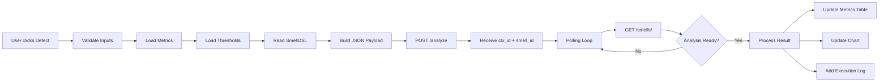
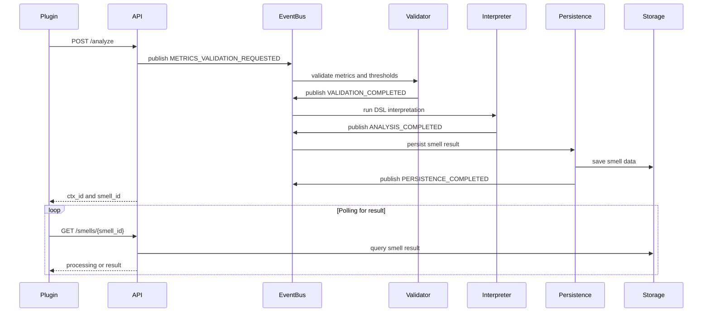

Eclipse Plugin -- SmellHunter Client
===================================

1\. Overview
------------

This plugin extends the Eclipse IDE to support the submission and visualization of software quality analysis performed by the **SmellHunter API**.

The plugin provides an integrated interface that allows developers to upload the required artifacts for smell detection, trigger asynchronous analyses, and visualize the returned metrics and results directly within the development environment.

By integrating analysis capabilities into the IDE, the tool aims to support developers during the development process without requiring external tools or workflow interruptions.

* * * * *

2\. Main Features
-----------------

### Artifact Management

The plugin allows developers to upload the artifacts required for smell detection:

-   **Smell DSL file (`.smelldsl`)**

-   **Metrics file (`.csv`)**

-   **Threshold definitions (`.csv`)**

These artifacts are validated before being sent to the SmellHunter API.

### Real-Time Input Validation

The interface provides visual indicators showing whether required inputs are present before enabling the analysis process.

This prevents invalid requests from being submitted to the detection service.

### Asynchronous Analysis Submission

Once all required files are provided, the plugin sends a request to the SmellHunter API using the `POST /analyze` endpoint.

The analysis is processed asynchronously by the backend infrastructure.

### Results Visualization

After the analysis is completed, the plugin retrieves results from the API and displays them in the IDE.

Results include:

-   detected smell types

-   analyzed metrics

-   rule evaluation results

-   contextual information related to the analyzed artifact

* * * * *

3\. Usage
---------

### Opening the Plugin View

In Eclipse:

Window → Show View → Other → SmellHunter

This opens the plugin interface inside the IDE workspace.

* * * * *

### Submitting an Analysis

1.  Attach the required files:

    -   DSL definition

    -   metrics file

    -   threshold file

2.  Once all required inputs are provided, the **Analyze** button becomes enabled.

3.  Clicking **Analyze** submits the request to the SmellHunter API.

* * * * *

### Retrieving Results

The plugin periodically queries the API using:

GET /status/<ctx_id>

Once processing is completed, results can be retrieved via:

GET /smells/<smell_id>

Detected smells and related metrics are then presented in the plugin interface.

* * * * *

4\. Screenshots
---------------

### Plugin Interface

### Artifact Upload

### Detection Results

* * * * *

5\. Technical Details
---------------------

| Component | Technology |
| --- | --- |
| IDE Platform | Eclipse RCP |
| Programming Language | Java |
| UI Toolkit | SWT |
| Integration | REST API |
| Backend Service | SmellHunter API |

* * * * *

6\. Role in the SmellHunter Ecosystem
-------------------------------------

The Eclipse plugin acts as the **developer-facing interface** of the SmellHunter platform.

It enables developers to interact with the detection infrastructure directly from their development environment, while the analysis itself is executed by the event-driven backend services.


7\. SmellDSL -- Domain Specific Language
=======================================

SmellHunter uses a **domain-specific language (DSL)** to formally describe code smells, their associated metrics, and the rules used to detect them.

The DSL enables developers and researchers to define detection logic independently from the analysis engine, making the system flexible and extensible.

A smell definition typically includes:

-   a **smell type** (high-level category)

-   one or more **features** based on software metrics

-   optional **symptoms** describing the smell

-   optional **treatments** suggesting refactoring actions

-   **rules** that define the detection logic.

* * * * *

Example Smell Definition
------------------------
```
smelltype DesignSmell;\
smelltype ImplementationSmell;

smell LongMethod extends ImplementationSmell {\
    feature LOC is Ratio with threshold 100, 200;\
    feature CYCLO is Interval with threshold 10, 20;\
    symptom "Methods too long";\
    treatment "Refactor by Extract Method";\
}

smell GodClass extends DesignSmell {\
    feature ATFD with threshold 4, 10;\
    feature TCC with threshold 3, 5;\
}
```

Each `feature` represents a software metric used to characterize the smell.

* * * * *

Detection Rules
---------------

Detection rules define the logical conditions used to identify smells during analysis.
```
rule R1 when
(LongMethod.LOC > LongMethod.LOC-LIMIT)
AND
(GodClass.ATFD > GodClass.ATFD-LIMIT)
then "Flag";

rule R2 when
(GodClass.ATFD > GodClass.ATFD-LIMIT)
AND
(GodClass.TCC > GodClass.TCC-LIMIT)
then "Flag";
```
During execution, these conditions are evaluated against the metric values provided in the analysis request.

* * * * *

Metrics Input
-------------

Metrics are provided as a CSV file containing metric identifiers and their measured values.

Example:

```
Metric,Valor
GodClass.ATFD,12
GodClass.TCC,4
LongMethod.LOC,300
LongMethod.CYCLO,200
```
* * * * *

Threshold Configuration
-----------------------

Thresholds define the limits used during rule evaluation.

Example:
```
Metrica,Valor
GodClass.ATFD-LIMIT,10
GodClass.TCC-LIMIT,5
LongMethod.LOC-LIMIT,100
LongMethod.CYCLO-LIMIT,10
```
During the analysis process, metric values are compared against these thresholds to determine whether smell conditions are satisfied.

* * * * *
8\. Workflow
-------------------------------------


This diagram illustrates the client-side workflow executed by the Eclipse plugin when a smell detection is triggered. The plugin first validates the required artifacts and loads the metrics, thresholds, and DSL definition. These inputs are then packaged into a JSON payload and sent to the SmellHunter API. Since the analysis is asynchronous, the plugin periodically polls the API until the result becomes available. Once completed, the detected smells and metrics are rendered in the plugin interface.

* * * * *
9\. Sequence Diagram
-------------------------------------

This sequence diagram represents the interaction between the plugin and the event-driven backend services. After receiving the request, the API publishes events to the internal event bus to trigger validation and DSL interpretation. Each service processes its task independently and emits completion events that drive the workflow forward.The final result is persisted and later retrieved by the plugin through polling requests. This architecture enables loosely coupled processing and scalable smell detection pipelines.
