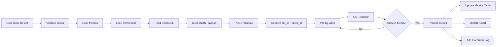
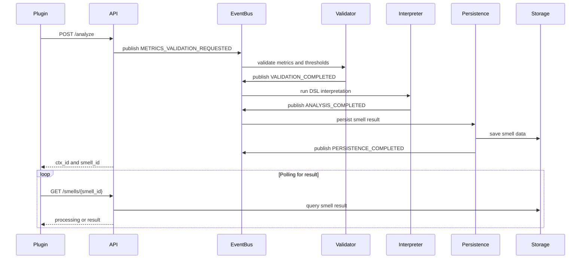

Eclipse Plugin -- SmellHunter Client
===================================

1\. Overview
------------

This plugin extends the Eclipse IDE to support the submission and visualization of software quality analysis performed by the **SmellHunter API**.

The plugin provides an integrated interface that allows developers to upload the required artifacts for smell detection, trigger asynchronous analyses, and visualize the returned metrics and results directly within the development environment.

By integrating analysis capabilities into the IDE, the tool aims to support developers during the development process without requiring external tools or workflow interruptions.

* * * * *

2\. Main Features
-----------------

### Artifact Management

The plugin allows developers to upload the artifacts required for smell detection:

-   **Smell DSL file (`.smelldsl`)**

-   **Metrics file (`.csv`)**

-   **Threshold definitions (`.csv`)**

These artifacts are validated before being sent to the SmellHunter API.

### Real-Time Input Validation

The interface provides visual indicators showing whether required inputs are present before enabling the analysis process.

This prevents invalid requests from being submitted to the detection service.

### Asynchronous Analysis Submission

Once all required files are provided, the plugin sends a request to the SmellHunter API using the `POST /analyze` endpoint.

The analysis is processed asynchronously by the backend infrastructure.

### Results Visualization

After the analysis is completed, the plugin retrieves results from the API and displays them in the IDE.

Results include:

-   detected smell types

-   analyzed metrics

-   rule evaluation results

-   contextual information related to the analyzed artifact

* * * * *

3\. Usage
---------

### Opening the Plugin View

In Eclipse:

Window → Show View → Other → SmellHunter

This opens the plugin interface inside the IDE workspace.

* * * * *

### Submitting an Analysis

1.  Attach the required files:

    -   DSL definition

    -   metrics file

    -   threshold file

2.  Once all required inputs are provided, the **Analyze** button becomes enabled.

3.  Clicking **Analyze** submits the request to the SmellHunter API.

* * * * *

### Retrieving Results

The plugin periodically queries the API using:

GET /status/<ctx_id>

Once processing is completed, results can be retrieved via:

GET /smells/<smell_id>

Detected smells and related metrics are then presented in the plugin interface.

* * * * *

4\. Screenshots
---------------

### Plugin Interface

### Artifact Upload

### Detection Results

* * * * *

5\. Technical Details
---------------------

| Component | Technology |
| --- | --- |
| IDE Platform | Eclipse RCP |
| Programming Language | Java |
| UI Toolkit | SWT |
| Integration | REST API |
| Backend Service | SmellHunter API |

* * * * *

6\. Role in the SmellHunter Ecosystem
-------------------------------------

The Eclipse plugin acts as the **developer-facing interface** of the SmellHunter platform.

It enables developers to interact with the detection infrastructure directly from their development environment, while the analysis itself is executed by the event-driven backend services.

* * * * *
7\. Workflow
-------------------------------------

* * * * *
8\. Sequence Diagram
-------------------------------------

